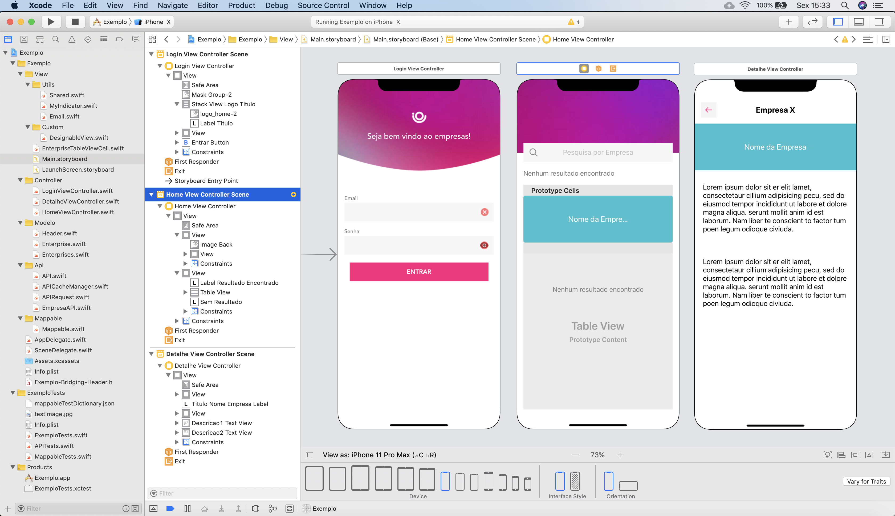

# empresas
Projeto com tela de login, tela de pesquisa de empresas e tela para ver detalhes da empresa. Foram consumidos serviços de login e de busca de empresas. Foram feitas as devidas validações nos campos do login. As telas foram testadas e estao funcionando no iPhone SE, iPhone 8, iPhone 8 Plus, iPhone X, iPhone 11, iPhone 11 Pro, iPhone 11 Pro Max.

O escopo abaixo foi atendido. 

Deve ser criado um aplicativo iOS utilizando Objective C ou Swift com as seguintes especificações:
Login e acesso de Usuário já registrado.
Para o login usamos padrões OAuth 2.0. Na resposta de sucesso do login a api retornará 3 custom headers (access-token, client, uid);
Para ter acesso as demais APIS, precisamos enviar esses 3 custom headers para a API autorizar a requisição;
Listagem de Empresas.
Detalhamento de Empresas.

TELAS CRIADAS:

